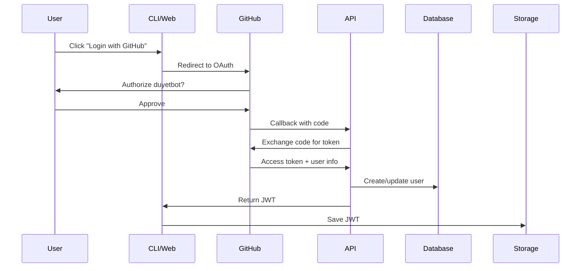

# duyetbot-agent Architecture

## Vision

**A personal AI agent system with persistent memory across multiple interfaces**, enabling users to interact with their agent from GitHub Actions, CLI, Web UI, or any other platform while maintaining full conversation history and context.

## Core Principles

1. **User-Centric**: Each user has their own agent with isolated data and sessions
2. **Interface-Agnostic**: Same agent accessible via GitHub Actions, CLI, Web, Mobile (future)
3. **Persistent Memory**: Full conversation history and context across all interfaces
4. **Centralized Storage**: Single source of truth for user data, sessions, and agent state
5. **Authentication**: Secure user identity via GitHub OAuth and Google OAuth
6. **Multi-Tenant**: Isolated user environments with shared infrastructure

---

## System Architecture

### High-Level Overview

```
┌─────────────────────────────────────────────────────────────────┐
│                         User Interfaces                          │
├─────────────────┬─────────────────┬─────────────────────────────┤
│  GitHub Actions │   CLI Tool      │      Web UI                 │
│  (Workflow)     │   (Terminal)    │   (Browser)                 │
└────────┬────────┴────────┬────────┴─────────┬───────────────────┘
         │                 │                  │
         └─────────────────┼──────────────────┘
                           │
                   ┌───────▼───────┐
                   │   Auth Layer  │
                   │ GitHub/Google │
                   │     OAuth     │
                   └───────┬───────┘
                           │
         ┌─────────────────┼─────────────────┐
         │                                   │
    ┌────▼─────┐                    ┌───────▼────────┐
    │   API    │◄───────────────────│  Auth Service  │
    │ Gateway  │                    │  (JWT/Session) │
    └────┬─────┘                    └────────────────┘
         │
         │
    ┌────▼──────────────────────────────────────────┐
    │          Central API (Cloudflare Workers)      │
    ├────────────────────────────────────────────────┤
    │                                                │
    │  ┌──────────────┐      ┌──────────────┐      │
    │  │  Agent Core  │      │ Session Mgr  │      │
    │  │  (LLM + Tools)│      │ (CRUD + Sync)│      │
    │  └──────────────┘      └──────────────┘      │
    │                                                │
    │  ┌──────────────┐      ┌──────────────┐      │
    │  │ User Manager │      │ Tool Registry│      │
    │  │ (Multi-tenant)│      │ (Plugins)    │      │
    │  └──────────────┘      └──────────────┘      │
    │                                                │
    └────────────────────┬───────────────────────────┘
                         │
         ┌───────────────┼───────────────┐
         │               │               │
    ┌────▼────┐   ┌──────▼──────┐  ┌────▼─────┐
    │ User DB │   │ Sessions DB │  │ Vector DB│
    │ (D1)    │   │ (D1 + KV)   │  │(Vectorize)│
    └─────────┘   └─────────────┘  └──────────┘
```

---

## Component Breakdown

### 1. User Interfaces (Client Layer)

#### GitHub Actions
```yaml
# .github/workflows/agent.yml
- uses: duyetbot/agent-action@v1
  with:
    github-token: ${{ secrets.GITHUB_TOKEN }}
    task: "Analyze PR and suggest improvements"
```

**Features**:
- Workflow integration
- PR comments with agent responses
- Commit status checks
- Automatic code review

#### CLI Tool
```bash
# Install globally
npm install -g @duyetbot/agent

# Authenticate
duyetbot login --github

# Interactive mode
duyetbot

# Direct execution
duyetbot ask "What are my recent sessions?"
```

**Features**:
- Terminal UI (Ink-based)
- Session persistence across terminals
- Offline queue (sync when online)
- Real-time streaming responses

#### Web UI
```
https://agent.duyet.net/
```

**Features**:
- Browser-based chat interface
- Session history browser
- Tool execution visualization
- Admin panel for settings

### 2. Authentication Layer

#### OAuth Providers
- **GitHub OAuth**: Primary for developer workflows
- **Google OAuth**: Secondary for broader access

#### Token Flow
```
User → OAuth Provider → Auth Callback → JWT Token → API Requests
```

#### JWT Claims
```json
{
  "sub": "github:123456",
  "email": "user@example.com",
  "name": "User Name",
  "picture": "https://...",
  "provider": "github",
  "iat": 1234567890,
  "exp": 1234567890
}
```

### 3. Central API (Cloudflare Workers)

#### Endpoints

**Authentication**
- `POST /auth/github/callback` - GitHub OAuth callback
- `POST /auth/google/callback` - Google OAuth callback
- `POST /auth/refresh` - Refresh JWT token
- `POST /auth/logout` - Invalidate session

**User Management**
- `GET /users/me` - Get current user profile
- `PATCH /users/me` - Update user settings
- `GET /users/me/usage` - Get usage statistics

**Session Management**
- `POST /sessions` - Create new session
- `GET /sessions` - List user's sessions
- `GET /sessions/:id` - Get session details
- `PATCH /sessions/:id` - Update session
- `DELETE /sessions/:id` - Delete session
- `GET /sessions/:id/messages` - Get session messages

**Agent Interaction**
- `POST /agent/chat` - Send message to agent
- `POST /agent/execute` - Execute tool
- `GET /agent/stream/:id` - SSE stream for real-time responses

**Data Sync**
- `POST /sync/pull` - Pull latest data from server
- `POST /sync/push` - Push local changes to server
- `GET /sync/status` - Check sync status

#### Request/Response Format

**Request**:
```typescript
POST /agent/chat
Authorization: Bearer <jwt>

{
  "sessionId": "session-123",
  "message": "Analyze this code...",
  "stream": true
}
```

**Response** (streaming):
```typescript
// SSE stream
data: {"type":"content","content":"Let me analyze"}
data: {"type":"content","content":" this code..."}
data: {"type":"tool","tool":"bash","input":"ls -la"}
data: {"type":"done","usage":{"tokens":150}}
```

### 4. Data Storage

#### User Database (Cloudflare D1)
```sql
CREATE TABLE users (
  id TEXT PRIMARY KEY,
  email TEXT UNIQUE NOT NULL,
  name TEXT,
  picture TEXT,
  provider TEXT NOT NULL, -- 'github' | 'google'
  provider_id TEXT NOT NULL,
  created_at INTEGER NOT NULL,
  updated_at INTEGER NOT NULL,
  settings JSON,
  UNIQUE(provider, provider_id)
);

CREATE INDEX idx_users_email ON users(email);
CREATE INDEX idx_users_provider ON users(provider, provider_id);
```

#### Sessions Database (Cloudflare D1 + KV)

**D1 (Metadata)**:
```sql
CREATE TABLE sessions (
  id TEXT PRIMARY KEY,
  user_id TEXT NOT NULL,
  state TEXT NOT NULL, -- 'active' | 'paused' | 'completed'
  title TEXT,
  created_at INTEGER NOT NULL,
  updated_at INTEGER NOT NULL,
  metadata JSON,
  FOREIGN KEY (user_id) REFERENCES users(id)
);

CREATE INDEX idx_sessions_user ON sessions(user_id, updated_at DESC);
CREATE INDEX idx_sessions_state ON sessions(user_id, state);
```

**KV (Messages - Hot Data)**:
```typescript
// Key: sessions:{sessionId}:messages
// Value: Array<LLMMessage>
{
  sessionId: "session-123",
  messages: [
    { role: "system", content: "..." },
    { role: "user", content: "..." },
    { role: "assistant", content: "..." }
  ]
}
```

**KV (Tool Results)**:
```typescript
// Key: sessions:{sessionId}:tools
{
  sessionId: "session-123",
  toolResults: [
    { toolName: "bash", status: "success", output: "...", timestamp: "..." }
  ]
}
```

#### Vector Database (Cloudflare Vectorize)

For semantic search over conversation history:

```typescript
// Embed and store each message
{
  id: "msg-123",
  userId: "user-456",
  sessionId: "session-789",
  content: "How do I deploy to Cloudflare Workers?",
  embedding: [0.1, 0.2, ...], // 1536 dimensions
  metadata: {
    role: "user",
    timestamp: "2024-01-01T00:00:00Z"
  }
}
```

**Use cases**:
- Find similar past conversations
- Retrieve relevant context for current query
- Semantic search across all user sessions

---

## Multi-Tenant Architecture

### User Isolation

**Data Isolation**:
- Each user's data is strictly isolated
- Database queries always filter by `user_id`
- KV keys namespaced by user: `users:{userId}:sessions:{sessionId}`

**Resource Limits** (per user):
- Max sessions: 1000
- Max messages per session: 10,000
- API rate limit: 100 req/min
- Storage quota: 1 GB

**Security**:
```typescript
// Middleware enforces user context
async function withAuth(request: Request): Promise<User> {
  const token = extractToken(request);
  const user = await verifyJWT(token);

  // All subsequent operations scoped to this user
  return user;
}

// Example usage
app.get('/sessions', withAuth, async (req, user) => {
  // Can only see own sessions
  return db.query('SELECT * FROM sessions WHERE user_id = ?', [user.id]);
});
```

---

## Client-Server Synchronization

### Online Mode
- Direct API calls to central server
- Real-time streaming responses
- Immediate persistence

### Offline Mode (CLI only)
```typescript
// Queue operations locally
const offlineQueue = new LocalQueue('~/.duyetbot/queue');

// When offline
await offlineQueue.push({
  type: 'chat',
  sessionId: 'session-123',
  message: 'What is TypeScript?',
  timestamp: Date.now()
});

// When back online
await offlineQueue.sync((operations) => {
  for (const op of operations) {
    await api.execute(op);
  }
});
```

### Conflict Resolution
- **Last-write-wins** for simple updates
- **Operational transformation** for concurrent edits (future)
- **Version vectors** for detecting conflicts

---

## Authentication Flow

### GitHub OAuth Flow



### API Request Flow

```typescript
// Every API request includes JWT
fetch('https://api.duyet.net/sessions', {
  headers: {
    'Authorization': `Bearer ${jwt}`,
    'Content-Type': 'application/json'
  }
});

// API validates and extracts user
const user = await validateJWT(jwt);

// All operations scoped to user
const sessions = await db.getUserSessions(user.id);
```

---

## Deployment Architecture

### Production Stack

**API Server**:
- **Platform**: Cloudflare Workers (edge compute)
- **Regions**: Global (300+ cities)
- **Scaling**: Automatic, unlimited
- **Cold start**: < 10ms

**Databases**:
- **D1**: SQLite at edge (metadata, users, sessions)
- **KV**: Global key-value (messages, hot data)
- **Vectorize**: Vector search (semantic memory)
- **R2**: Object storage (file uploads, exports)

**Authentication**:
- **Workers**: OAuth callbacks + JWT generation
- **JWT**: HS256 signed with secret in Workers secrets

**CDN**:
- **Cloudflare CDN**: Static assets (web UI)
- **Pages**: Web UI deployment

### Infrastructure as Code

```typescript
// wrangler.toml
[env.production]
name = "duyetbot-api"
compatibility_date = "2024-01-01"

[[d1_databases]]
binding = "DB"
database_name = "duyetbot-prod"
database_id = "xxx"

[[kv_namespaces]]
binding = "KV"
id = "xxx"

[[vectorize]]
binding = "VECTORIZE"
index_name = "conversations"

[vars]
ENVIRONMENT = "production"
API_URL = "https://api.duyet.net"
WEB_URL = "https://agent.duyet.net"

[secrets]
# Set via: wrangler secret put <NAME>
JWT_SECRET = "<secret>"
GITHUB_CLIENT_ID = "<id>"
GITHUB_CLIENT_SECRET = "<secret>"
GOOGLE_CLIENT_ID = "<id>"
GOOGLE_CLIENT_SECRET = "<secret>"
ANTHROPIC_API_KEY = "<key>"
```

---

## Interface-Specific Features

### GitHub Actions

**Auto-review PRs**:
```yaml
on:
  pull_request:
    types: [opened, synchronize]

jobs:
  review:
    runs-on: ubuntu-latest
    steps:
      - uses: duyetbot/agent-action@v1
        with:
          task: "review"
          github-token: ${{ secrets.GITHUB_TOKEN }}
```

**Custom workflows**:
```yaml
- uses: duyetbot/agent-action@v1
  with:
    task: |
      Analyze test coverage and suggest missing tests for:
      ${{ github.event.pull_request.changed_files }}
```

### CLI Tool

**Session management**:
```bash
duyetbot sessions ls                    # List all sessions
duyetbot sessions new "Code review"     # Create new session
duyetbot sessions resume session-123    # Resume session
duyetbot sessions export session-123    # Export to JSON
```

**Offline support**:
```bash
# Works offline, queues operations
duyetbot ask "What is Rust?" --offline

# Later, when online
duyetbot sync  # Syncs queued operations
```

### Web UI

**Features**:
- Chat interface with markdown rendering
- Code syntax highlighting
- Session browser with search
- Tool execution visualization
- Settings panel (API keys, preferences)
- Export/import sessions

**Tech stack**:
- React + TypeScript
- TailwindCSS
- Deployed on Cloudflare Pages
- Real-time updates via SSE

---

## Security Considerations

### Authentication
- ✅ OAuth 2.0 (GitHub/Google)
- ✅ JWT with short expiration (1 hour)
- ✅ Refresh tokens for long sessions
- ✅ Secure token storage (httpOnly cookies for web)

### Authorization
- ✅ User-scoped data access
- ✅ Row-level security in database queries
- ✅ API rate limiting per user
- ✅ Resource quotas enforcement

### Data Protection
- ✅ Encryption at rest (Cloudflare handles)
- ✅ Encryption in transit (TLS)
- ✅ No sensitive data in logs
- ✅ User data export/deletion (GDPR)

### API Security
- ✅ CORS policies
- ✅ Input validation
- ✅ SQL injection prevention (parameterized queries)
- ✅ XSS prevention (sanitized outputs)

---

## Scalability

### Performance Targets
- API latency: < 100ms (p95)
- LLM streaming: < 500ms to first token
- Concurrent users: 10,000+
- Database queries: < 10ms (p95)

### Scaling Strategy
- **Horizontal**: Cloudflare Workers auto-scale
- **Database**: D1 replication across regions
- **Cache**: Aggressive KV caching for hot data
- **Rate limiting**: Per-user limits prevent abuse

### Cost Optimization
- Free tier: 100K requests/day on Workers
- D1: $0.75/million reads
- KV: First 100K ops/day free
- R2: No egress fees

---

## Future Enhancements

### Phase 1: Mobile App
- iOS/Android native apps
- Push notifications for agent responses
- Voice input/output
- Offline mode with full sync

### Phase 2: Team Workspaces
- Shared sessions across team members
- Role-based access control
- Team usage analytics
- Centralized billing

### Phase 3: Plugin System
- Custom tools via API
- Third-party integrations
- Marketplace for community plugins
- Revenue sharing

### Phase 4: Advanced AI Features
- Multi-agent collaboration
- Long-term memory (vector embeddings)
- Proactive suggestions
- Learning from user feedback

---

## Migration Path

### From Current Architecture

**Current** (Local-only):
```
~/.duyetbot/
├── sessions/
│   └── session-123.json
└── queue/
```

**Migration Strategy**:
1. CLI detects first run with central API
2. Offers to migrate local sessions to cloud
3. Uploads sessions to user's account
4. Keeps local backup
5. Switches to cloud mode

**Backward Compatibility**:
- CLI can run in offline-only mode
- No central API required for basic usage
- Opt-in to cloud sync

---

## Technology Stack Summary

| Component | Technology | Rationale |
|-----------|-----------|-----------|
| API Server | Cloudflare Workers | Edge compute, auto-scale, low latency |
| Database | Cloudflare D1 | SQLite at edge, global distribution |
| Cache | Cloudflare KV | Fast key-value, global replication |
| Vector DB | Cloudflare Vectorize | Semantic search, built-in embeddings |
| Storage | Cloudflare R2 | S3-compatible, no egress fees |
| Web UI | React + CF Pages | Static hosting, CDN |
| CLI | Node.js + Ink | Cross-platform, rich terminal UI |
| GitHub Action | TypeScript Action | Native GitHub integration |
| Auth | OAuth 2.0 + JWT | Industry standard, secure |
| LLM | Anthropic Claude | Best-in-class reasoning, long context |
| Monitoring | Cloudflare Analytics | Built-in, no extra cost |

---

## Development Priorities

### MVP (Minimum Viable Product)
1. ✅ Core agent system (done)
2. ✅ Local CLI (done)
3. 🚧 Central API with authentication
4. 🚧 Session sync to cloud
5. 🚧 Web UI
6. 🚧 GitHub Actions integration

### Post-MVP
1. Offline mode for CLI
2. Vector search for semantic memory
3. Team workspaces
4. Mobile apps
5. Plugin marketplace

---

This architecture provides:
- ✅ **Centralized** user data and sessions
- ✅ **Multi-interface** access (GitHub Actions, CLI, Web)
- ✅ **Persistent memory** across all interfaces
- ✅ **Scalable** to millions of users
- ✅ **Secure** authentication and data isolation
- ✅ **Cost-effective** Cloudflare edge deployment
