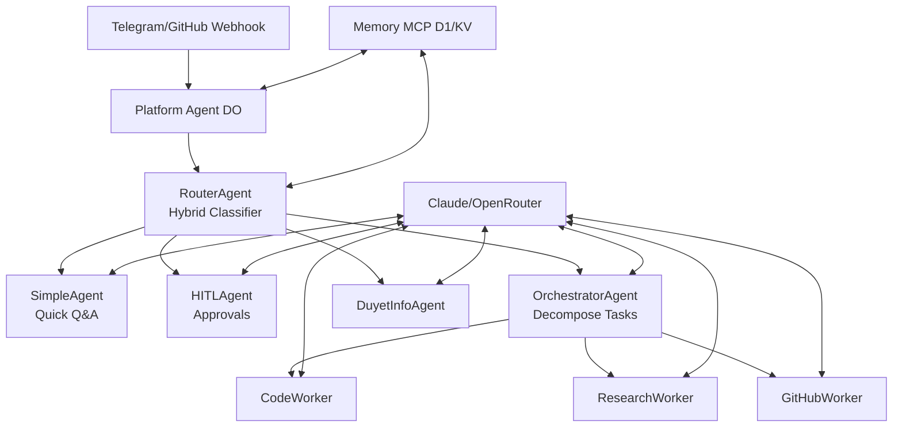

# duyetbot-agent

**TL;DR**: Clone. `bun install`. `bun run cli chat` for local. `bun run deploy:telegram` for prod. Ask anything!

## 🚀 Vision

Build autonomous edge AI agents. Run on Cloudflare DO/D1. Zero-infra. Persistent MCP memory. Multi-platform: CLI/Telegram/GitHub.

> **Why?** Save 75% tokens via smart routing. Scale globally. Cost: free idle.

## 🎯 30s Quickstarts

### CLI (Local)
```bash
git clone https://github.com/duyet/duyetbot-agent
cd duyetbot-agent
bun install
bun run cli chat
```
Try: `> Explain Durable Objects`

**✅ Done!** Chat with 8 agents + memory.

### Telegram (Prod)
```bash
bun install
bunx wrangler login
bun scripts/config.ts telegram  # Add TELEGRAM_BOT_TOKEN
bun run deploy:telegram
```
Set webhook at [@BotFather](https://t.me/botfather). Ping bot!

## 🏗️ Phase 1 Architecture



**8 Durable Objects.** Shared via `script_name` bindings.

## 📖 Sections

- [Getting Started →](/getting-started/env-setup)
- [Guides →](/guides/telegram-bot-setup)
- [Architecture](/architecture)
- [Deployment](/deployment)

## 🔍 Search This Doc

**Prompt**: "Quickstart for GitHub bot" → Jump to guide.

**Quiz**: What deploys Telegram?  
A: `bun run deploy:telegram` ✅

**Next**: [Env Setup →](/getting-started/env-setup)  
**⭐ Star** [GitHub](https://github.com/duyet/duyetbot-agent){{t('cta.star')}}