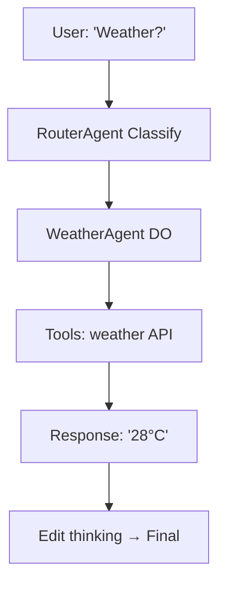

# Build Custom Agent

**TL;DR**: Extend `BaseAgent`. Add class/bind in `shared-agents`. `bun run deploy:shared-agents`. Test via Telegram!

Create "WeatherAgent". Runs in 5 mins.

## 📋 Prerequisites

- [ ] [Getting Started →](/getting-started/env-setup)
- [ ] Deployed: `bun run deploy:shared-agents`

## 🛠️ Step 1: Create Agent

In [`packages/chat-agent/src/agents/`](packages/chat-agent/src/agents/):

```typescript
// weather-agent.ts
import { BaseAgent } from '../base-agent.js';

export class WeatherAgent extends BaseAgent {
  name = 'WeatherAgent';

  async execute(query: string) {
    // Fetch weather via tool
    const weather = await this.tools.weather(query);
    return `Weather: ${weather}`;
  }
}
```

Export in `index.ts`:

```typescript
export { WeatherAgent } from './weather-agent.js';
```

## 🔗 Step 2: Bind DO

In [`apps/shared-agents/wrangler.toml`](apps/shared-agents/[`wrangler.toml`](apps/shared-agents/wrangler.toml)):

```toml
[[durable_objects.bindings]]
name = "WeatherAgent"
class_name = "WeatherAgent"
```

## 🚀 Step 3: Deploy & Test

```bash
bun run deploy:shared-agents
```

Router auto-routes "weather" queries.

**Test Telegram**: "What's Hanoi weather?"

**Expect**: "Weather: 28°C sunny"

## 🔄 Agent Flow Mermaid



## 🎯 Quiz

**Q**: Bind new DO where?  
A: `shared-agents/wrangler.toml` ✅

**Pro Tip**: Add pattern `/weather/i` in router for fast route.

## 🚀 Next

[Telegram Setup →](/guides/telegram-bot-setup)  
**Build now**: Add WeatherAgent! {{t('agent.live')}}