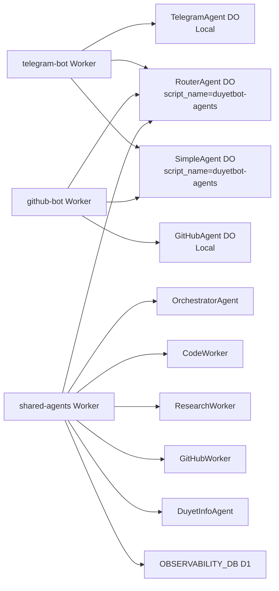

# Cloudflare First

**TL;DR**: `bun run deploy:shared-agents`. Deploys 8 DOs + D1. Binds via `script_name`. Edge everywhere.

Run agents on Durable Objects + D1. No servers. Global replication.

## 🏗️ DO/D1 Edges

**Durable Objects**: Stateful. Per-user sessions. Batch queues. Heartbeats.

**D1**: Memory MCP. Cross-session. User-isolated.

From [`wrangler.toml`](apps/shared-agents/[`wrangler.toml`](apps/shared-agents/wrangler.toml)):

- Local: `TelegramAgent`
- Shared: `RouterAgent` via `script_name = "duyetbot-agents"`

## 🔗 DO Binding Mermaid



**One deploy scales all bots.**

## 🚀 Simple Flow

```bash
bun run deploy:shared-agents  # 8 DOs + D1
bun run deploy:telegram       # Binds shared DOs
```
**✅ Agents live!** Test: Ping Telegram.

**Quiz**: Shared DOs via?  
A: `script_name` ✅

## 🚀 Next

[Build Agent →](/guides/build-custom-agent)  
**Deploy edges**: `bun run deploy:shared-agents`! {{t('cf.edges_ready')}}