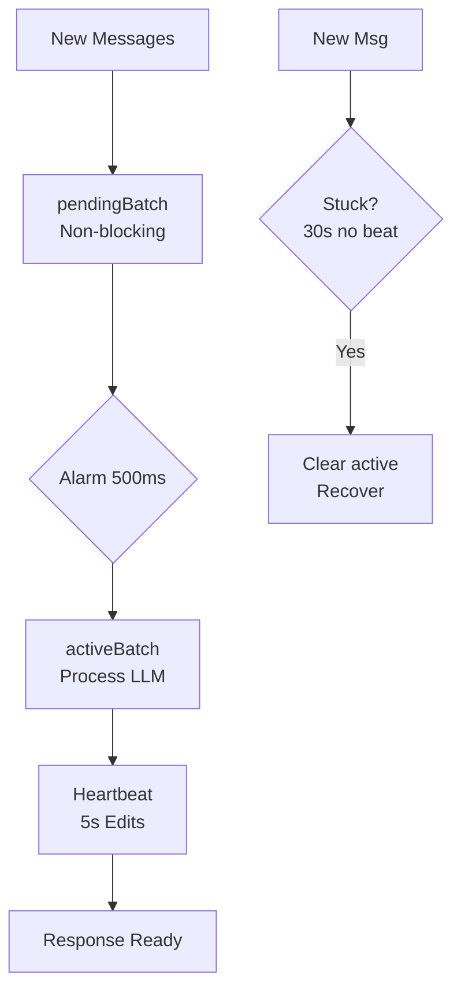

<!-- i18n: en -->

# DO Limits & Alarms ✅

**TL;DR**: Track quotas daily. Schedule alarms wisely. Rotate heartbeats. Recover stuck batches automatically.

## Table of Contents
- [Quotas Table](#quotas-table)
- [Alarm Usage](#alarm-usage)
- [Heartbeat Mechanism](#heartbeat-mechanism)
- [Scaling Flow](#scaling-flow)

## Quotas Table

Monitor Cloudflare DO limits. Stay under free tier.

From [`PLAN.md`](PLAN.md).

| Metric       | Free Tier   | Paid Tier | Impact                  |
|--------------|-------------|-----------|-------------------------|
| Requests/day | 100,000     | 10M+      | Messages/invocations    |
| Alarms/day   | 1,000       | Unlimited | Batch triggers          |
| CPU Time/day | 50,000ms    | 10Mms     | Processing budget       |
| Burst CPU    | 30s         | 30s       | Single execution limit  |

Batch messages. Use patterns. Avoid quota exhaustion.

## Alarm Usage

Alarms trigger `onBatchAlarm()`. Collects pending messages.

Tune window for efficiency.

From [`packages/chat-agent/src/batch-types.ts`](packages/chat-agent/src/batch-types.ts:102):

```typescript
// packages/chat-agent/src/batch-types.ts
const DEFAULT_BATCH_CONFIG = {
  windowMs: 500,    // Fast collection
  maxWindowMs: 5000, // Max wait
  maxMessages: 10,
};

// Set alarm
this.ctx.storage.setAlarm(Date.now() + config.windowMs);
```

Test: `bun run test --filter batch`.

## Heartbeat Mechanism

Edit thinking message every 5s. Proves DO alive.

Detect stuck: `now - lastHeartbeat > 30_000ms`.

From [`PLAN.md`](PLAN.md:326):

```
"Thinking 🧠" → "Still thinking... ⏳" → "Almost there... 🔄"
```

Auto-recovery: Clear `activeBatch`. Promote `pendingBatch`.

## Scaling Flow



**Quiz**: Free tier alarms/day?

A: 1,000 ✅  
B: 10,000  
C: Unlimited

**Related**:
- [Batching Strategies →](./batching-strategies.md)
- [Core Batching →](/core-concepts/batching-alarms)

Run `wrangler tail`. Watch alarms and heartbeats live!