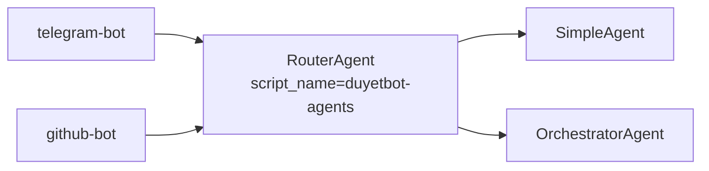

<!-- i18n: en -->

# Durable Objects ✅

**TL;DR**: 8 DOs shared via script_name bindings. Telegram/GitHub bots reference duyetbot-agents. Zero-dupe code. SQLite persistence.

## Table of Contents
- [8 DOs](#8-dos)
- [Bindings](#bindings)
- [Pattern](#pattern)
- [Code Snippet](#code-snippet)

## 8 DOs

Deployed in `duyetbot-agents`:

| DO | Purpose | Called By |
|----|---------|-----------|
| RouterAgent | Classify/route | Platform Agents |
| SimpleAgent | Quick Q&A | Router |
| OrchestratorAgent | Multi-step | Router |
| HITLAgent | Approvals | Router |
| CodeWorker | Code tasks | Orchestrator |
| ResearchWorker | Research | Orchestrator |
| GitHubWorker | GitHub ops | Orchestrator |
| DuyetInfoAgent | Duyet info | Router |

## Bindings

Telegram wrangler.toml:

```toml
[[durable_objects.bindings]]
name = "RouterAgent"
class_name = "RouterAgent"
script_name = "duyetbot-agents"
```



## Pattern

**Shared DO**: Single code/deploy. Multi-app bindings. SQLite state survives restarts.

**Benefits**: 2400 LOC reused. Global replication. Free.

## Code Snippet

[`apps/shared-agents/src/index.ts`](apps/shared-agents/src/index.ts:61)
```typescript
export const RouterAgent = createRouterAgent<SharedEnv>({ ... });
```

**Quiz**: script_name vs Local DO?  
A: script_name shares cross-worker; Local app-only ✅

**Related**: [Deployment →](../deployment) | [Batching →](./batching-alarms.md)

**Deploy**: `bun run deploy:shared-agents` → All 8 DOs live!