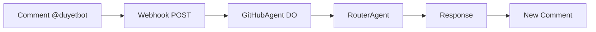

# GitHub Bot Setup

**TL;DR**: GitHub App → PAT/webhook secret → `bun scripts/config.ts github` → `bun run deploy:github` → `@duyetbot hi`!

@mention handler ready. 3 mins.

## 📋 Step 1: GitHub App

1. [Developer Settings](https://github.com/settings/apps) → New App
2. **GitHub App name**: `duyetbot`
3. Permissions: Issues/PRs read/write
4. Webhook: Active. Payload URL: `https://github.duyetbot.workers.dev/webhook`
5. **Private key**: Download `.pem`
**Copy**: App ID, Installation ID.

## 🔧 Step 2: Config & Deploy

```bash
bun scripts/config.ts github  # PAT + webhook secret
bun run deploy:github
```

**✅ Deployed!** Webhook live.

## 🧪 Step 3: Test

1. Your repo → New issue
2. Comment: `@duyetbot hello`
**Expect**: Bot replies "Hi!".

## 📋 Checklist

- [ ] GitHub App created
- [ ] Permissions: Issues/PRs
- [ ] `bun scripts/config.ts github`
- [ ] `bun run deploy:github`
- [ ] Test: `@duyetbot hi` responds

**Quiz**: Triggers bot?  
A: `@duyetbot hello` ✅

## 🔄 GitHub Flow



## 🎉 Done!

**All 8 agents** respond to mentions.

**⭐ Star** repo! {{t('github.active')}}