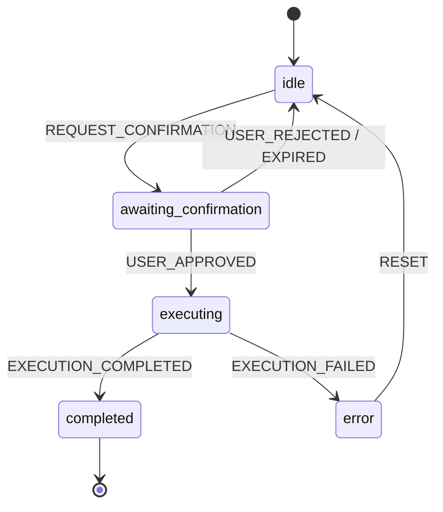

<!-- i18n: en -->

# HITL Integration ✅

**TL;DR**: Detect risky tools → Request confirm (yes/no). State machine: idle → awaiting → executing → done. 5min expiry.

## Table of Contents
- [Risk Detection](#risk-detection)
- [State Machine](#state-machine)
- [Confirmation Flows](#confirmation-flows)
- [Code Snippets](#code-snippets)
- [Error Handling](#error-handling)
- [Try It](#try-it)

## Risk Detection

Auto-classify tools: low/medium/high. High-risk (bash/delete) → confirm.

From [`confirmation.ts`](packages/chat-agent/src/hitl/confirmation.ts:163)

```typescript
export function determineRiskLevel(toolName: string, args?: Record<string, unknown>): RiskLevel {
  // bash, delete, drop → 'high'
  // read, get → 'low'
}
```

| Risk | Examples | Confirm? |
|------|----------|----------|
| high 🔴 | bash, delete, push | ✅ Always |
| medium 🟡 | write, update | Threshold |
| low 🟢 | list, search | ❌ Never |

## State Machine



From [`state-machine.ts`](packages/chat-agent/src/hitl/state-machine.ts:38)

```typescript
export type HITLStatus = 'idle' | 'awaiting_confirmation' | 'executing' | 'completed' | 'error';
```

## Confirmation Flows

Parse user reply:

```typescript
// yes/ok/✅ → approve
// no/cancel/❌ → reject
parseConfirmationResponse("yes") // { action: 'approve' }
```

Format request [`confirmation.ts`](packages/chat-agent/src/hitl/confirmation.ts:254)

```
🔴 **Confirmation Required**
**Tool:** `bash`
**Risk:** high
**Args:** {"command": "rm file.txt"}
Reply **yes** or **no**.
```

## Code Snippets

HITL Agent integration [`hitl-agent.ts`](packages/chat-agent/src/agents/hitl-agent.ts:211)

```typescript
if (requiresConfirmation(toolName)) {
  return requestConfirmations(toolCalls);
}
```

Execute approved [`executions.ts`](packages/chat-agent/src/hitl/executions.ts:125)

```typescript
const result = await executeApprovedTools(approved, executor);
```

## Error Handling

| Code | Status | Desc |
|------|--------|------|
| HITL_001 | 400 | Invalid confirmation |
| EXEC_TIMEOUT | 408 | Tool timeout (30s) |
| CONF_EXPIRED | 410 | 5min expiry |

**Quiz**: "no because risky" → ?
A: reject + reason ✅

## Try It

1. `bun run deploy:telegram`
2. Ask: "Delete all files" → See confirm!
3. Reply "yes" → Executes (safely).

**Related**: [Agents](../core-concepts/agents/) | [Tools](../core-concepts/tools.md)