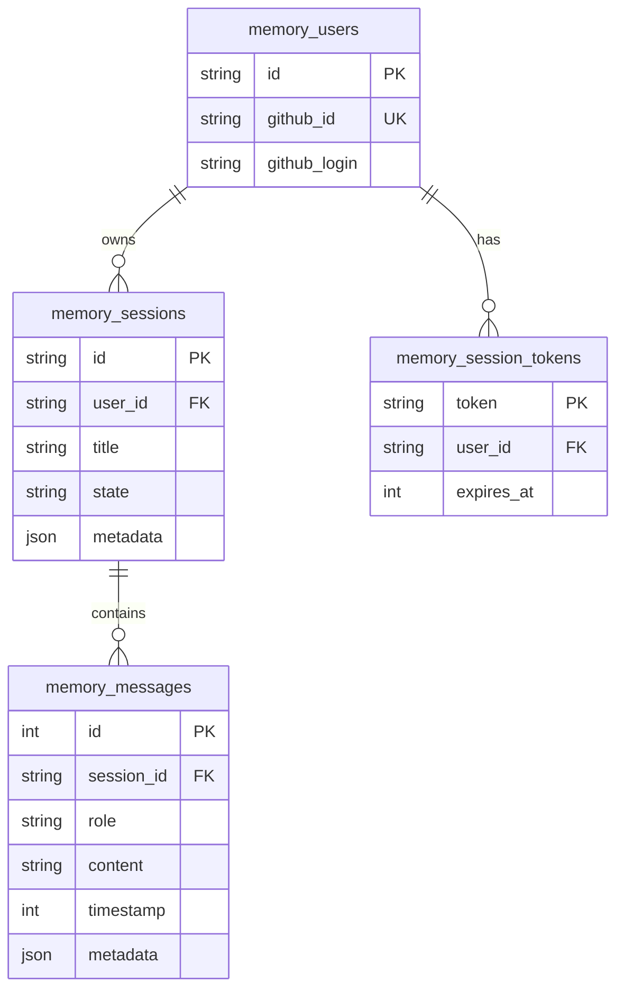

<!-- i18n: en -->

# Memory MCP ✅

**TL;DR**: Stores conversations in D1. Auth via GitHub. MCP tools enable agents to save/retrieve/search memory.

## Table of Contents
- [ERD](#erd)
- [MCP Tools](#mcp-tools)
- [Auth Flow](#auth-flow)
- [Code Snippet](#code-snippet)

## ERD



**Key**: User-isolated. Tokens expire 7d. Messages searchable.

## MCP Tools

| Tool | Input | Output | Usage |
|------|--------|--------|-------|
| `authenticate` | `github_token` | `session_token` | Auth agents |
| `save_memory` | `messages[]`, `session_id?` | `saved_count` | Persist convos ✅ |
| `get_memory` | `session_id`, `limit?` | `messages[]` | Load context |
| `search_memory` | `query` | `results[]` w/score/context | Semantic recall |
| `list_sessions` | `limit?` | `sessions[]` w/count | Session mgmt |

## Auth Flow

1. Agent calls `authenticate(github_token)`
2. Verify GitHub → Create user/session_token
3. Use token for all ops

## Code Snippet

[`apps/memory-mcp/src/mcp-agent.ts`](apps/memory-mcp/src/mcp-agent.ts:29)
```typescript
this.server.tool('save_memory', 'Save messages', {
  session_id: z.string().optional(),
  messages: z.array(...),
}, async ({session_id, messages}) => {
  // D1 save
});
```

**Quiz**: Memory vs DO State?  
A: Memory cross-session D1; DO per-convo state ✅

**Related**: [Tools →](./tools.md) | [Architecture →](../architecture.md)

**Next**: Authenticate → `@duyetbot save_memory [{"role":"user","content":"test"}]`