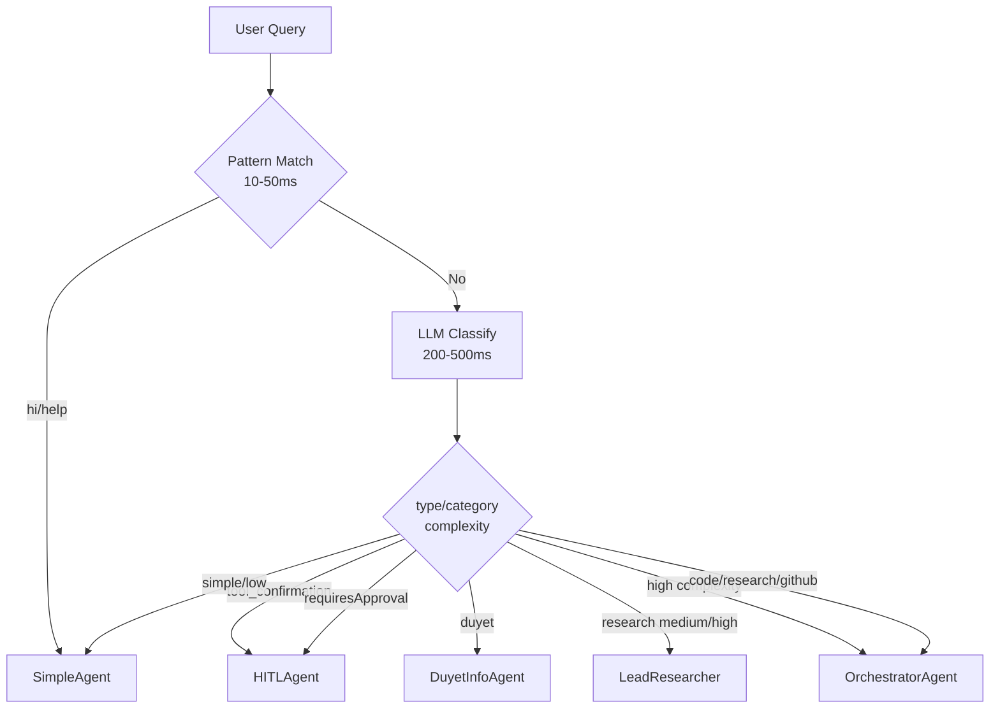

<!-- i18n: en -->

# Router Agent ✅

**TL;DR**: Analyzes queries with patterns (instant) then LLM. Routes to Simple/Orchestrator/HITL/etc. Saves 75% tokens via smart dispatch.

## Table of Contents
- [Hybrid Flow](#hybrid-flow)
- [Decision Tree](#decision-tree)
- [Code Snippet](#code-snippet)

## Hybrid Flow

RouterAgent uses two-phase classification:



**Key**: Patterns hit 80% cases instantly. LLM fallback for semantics.

## Decision Tree

| Priority | Condition | Route |
|----------|-----------|-------|
| 1 | `type: tool_confirmation` | hitl-agent ✅ |
| 2 | `requiresHumanApproval: true` | hitl-agent |
| 3 | `category: duyet` | duyet-info-agent |
| 4 | `research + medium/high` | lead-researcher-agent |
| 5 | `complexity: high` | orchestrator-agent |
| 6 | `simple + low` | simple-agent |
| 7 | `code/research/github` | orchestrator-agent (→workers) |

## Code Snippet

[`packages/chat-agent/src/routing/classifier.ts`](packages/chat-agent/src/routing/classifier.ts:143)
```typescript
export function determineRouteTarget(classification: QueryClassification): RouteTarget {
  if (classification.type === 'tool_confirmation') return 'hitl-agent';
  // ... hybrid logic
}
```

**Quiz**: Router vs Simple?  
A: Router classifies/routs; Simple answers directly ✅

**Glossary**: [Hybrid Classify →](/core-concepts/agents/router-agent#hybrid-flow)

**Related**: [Orchestrator →](./orchestrator-agent.md) | [Architecture →](../architecture.md)

**Try**: `@duyetbot classify "fix this code"` → See routing live!