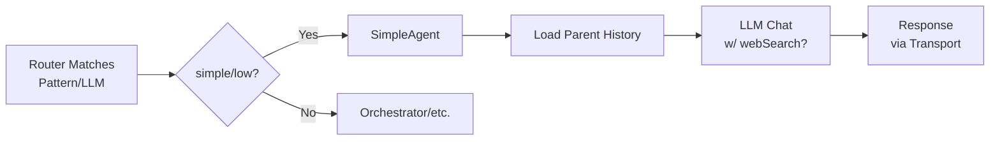

<!-- i18n: en -->

# Simple Agent ✅

**TL;DR**: Answers greetings/general knowledge directly via LLM. Fast, no tools/orchestration. Fallback for 80% queries.

## Table of Contents
- [Flow](#flow)
- [When Routed](#when-routed)
- [Code Snippet](#code-snippet)

## Flow



**Key**: Stateless. History from parent CloudflareChatAgent. Web search via :online models.

## When Routed

Router sends here for:
- Patterns: hi/help/thanks ✅
- `type: simple + complexity: low`
- General knowledge (no tools needed)

| Trigger | Example | Latency |
|---------|---------|---------|
| Pattern | "hi" | <100ms |
| LLM | "explain recursion" | 1-3s |

## Code Snippet

[`packages/chat-agent/src/agents/simple-agent.ts`](packages/chat-agent/src/agents/simple-agent.ts:190)
```typescript
async execute(query: string, context: AgentContext): Promise<AgentResult> {
  const provider = config.createProvider(env, context);
  const llmMessages = [{ role: 'system', content: systemPrompt }, ...history, { role: 'user', content: query }];
  const response = await provider.chat(llmMessages, undefined, { webSearch: true });
}
```

**Quiz**: Simple vs Router?  
A: Simple executes; Router classifies ✅

**Related**: [Router →](./router-agent.md) | [Transports →](../transports.md)

**Next**: Deploy & test: `bun run deploy:telegram` → "hi" → SimpleAgent!