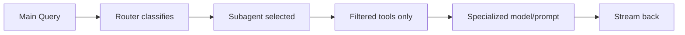

<!-- i18n: en -->

# Subagents ✅

**TL;DR**: `createSubagent({name, tools, prompt})` → Delegate via `agents[]` in query(). Predefined: researcher etc.

## Table of Contents
- [Predefined](#predefined)
- [Registry](#registry)
- [Usage](#usage)
- [Delegation Flow](#delegation-flow)

## Predefined

From [`subagent.ts`](packages/core/src/sdk/subagent.ts:50)

| Name | Tools | Model | Role |
|------|-------|-------|------|
| researcher | research/web_search/fetch_url | haiku | Gather/summarize |
| codeReviewer | bash/git | sonnet | Review/security |
| planner | plan | haiku | Decompose tasks |
| gitOperator | git/bash | haiku | Branches/merges |
| githubAgent | github | haiku | Issues/PRs |

```typescript
export const predefinedSubagents = {
  researcher: createSubagent({
    name: 'researcher',
    description: 'Research and gather information from the web',
    tools: ['research', 'web_search', 'fetch_url'],
    model: 'haiku',
  }),
  // ...
};
```

## Registry

```typescript
const registry = createSubagentRegistry();
registry.registerAll(Object.values(predefinedSubagents));
```

Filter tools: `filterToolsForSubagent(allTools, subagent)`

## Usage

In query [`query.ts`](packages/core/src/sdk/query.ts:147)

```typescript
await query("Research X", {
  agents: [predefinedSubagents.researcher],
  tools: allTools  // Filtered auto
});
```

Options: `createSubagentOptions(parentOpts, subagent, tools)`

## Delegation Flow



**Quiz**: researcher tools?
A: research/web_search ✅

**Try**: `getPredefinedSubagent('researcher')` → Delegate!

**Related**: [Query ←](./query.md)