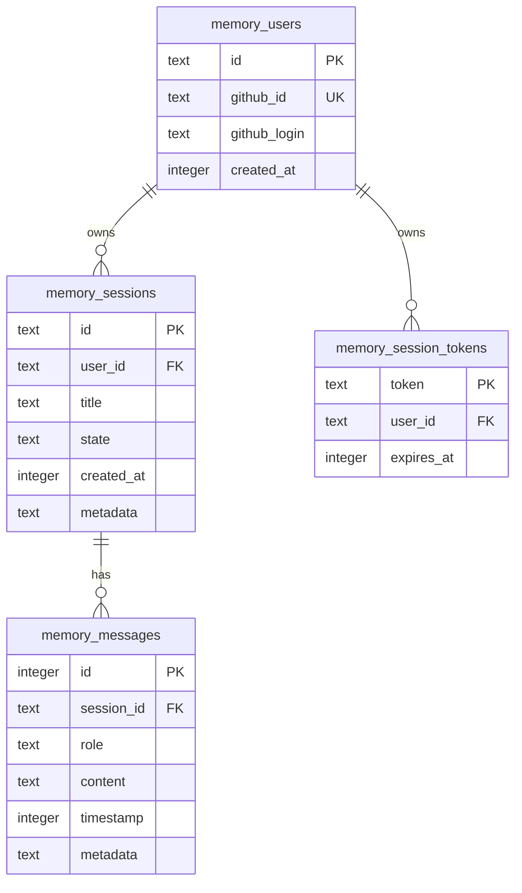

<!-- i18n: en -->

# D1 Tables & ERD ✅

**TL;DR**: memory_* prefixed. Users → Sessions → Messages. Indexes: session/timestamp/content.

## Table of Contents
- [ERD](#erd)
- [Tables](#tables)
- [Indexes](#indexes)
- [Queries](#queries)

## ERD

From migrations [`0001_initial_schema.sql`](apps/memory-mcp/migrations/0001_initial_schema.sql:5), [`0004_rename_with_prefix.sql`](apps/memory-mcp/migrations/0004_rename_with_prefix.sql:7)



## Tables

**memory_users**:

```sql
CREATE TABLE memory_users (
  id TEXT PRIMARY KEY,
  github_id TEXT UNIQUE NOT NULL,
  github_login TEXT NOT NULL,
  created_at INTEGER NOT NULL
);
```

**memory_sessions**:

```sql
CREATE TABLE memory_sessions (
  id TEXT PRIMARY KEY,
  user_id TEXT NOT NULL,
  title TEXT,
  state TEXT DEFAULT 'active',
  FOREIGN KEY(user_id) REFERENCES memory_users(id)
);
```

**memory_messages** [`0002_messages_table.sql`](apps/memory-mcp/migrations/0002_messages_table.sql:5)

```sql
CREATE TABLE memory_messages (
  id INTEGER PRIMARY KEY AUTOINCREMENT,
  session_id TEXT NOT NULL,
  role TEXT CHECK(role IN ('user','assistant','system')),
  content TEXT NOT NULL,
  FOREIGN KEY(session_id) REFERENCES memory_sessions(id)
);
```

## Indexes

Perf: session/timestamp/content.

```sql
CREATE INDEX idx_memory_messages_session ON memory_messages(session_id, timestamp ASC);
CREATE INDEX idx_memory_messages_content ON memory_messages(session_id, content);
```

## Queries

**List recent**:

```sql
SELECT * FROM memory_sessions 
WHERE user_id = ? 
ORDER BY updated_at DESC 
LIMIT 20;
```

**Search**:

```sql
SELECT * FROM memory_messages 
WHERE session_id = ? AND content LIKE ? 
ORDER BY timestamp;
```

**Quiz**: FK cascade delete?
A: Sessions → Messages ✅

**Migrate**: `wrangler d1 migrations apply memory-mcp`

**Related**: [Schemas ←](./schemas.md)