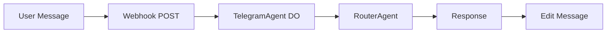

# Telegram Bot Setup

**TL;DR**: [@BotFather](https://t.me/botfather) → token → `bun scripts/config.ts telegram` → `bun run deploy:telegram` → webhook → "hi"!

Chat interface ready. 2 mins.

## 📋 Step 1: BotFather Token

1. [@BotFather](https://t.me/botfather)
2. `/newbot`
3. Name: `duyetbot`
4. Username: `your_duyetbot`
**Copy**: `123456:ABC-DEF...` token.

## 🔧 Step 2: Config & Deploy

```bash
bun scripts/config.ts telegram  # Paste token
bun run deploy:telegram
```

**✅ Deployed!** `telegram.duyetbot.workers.dev`

## 🌐 Step 3: Webhook

BotFather → `/setwebhook` → `https://YOUR_WORKER.workers.dev/webhook`

Or API:
```bash
curl -X POST https://api.telegram.org/bot$TOKEN/setWebhook?url=https://YOUR_WORKER.workers.dev/webhook
```

## 🧪 Step 4: Test

Message bot: `hi`
**Expect**: "Thinking 🧠" → Greeting.

## 📋 Checklist

- [ ] Token from BotFather
- [ ] `bun scripts/config.ts telegram`
- [ ] `bun run deploy:telegram`
- [ ] Webhook set
- [ ] Test: "hi" responds

**Quiz**: Sets webhook?  
A: BotFather `/setwebhook` ✅

## 🔄 Telegram Flow



## 🚀 Next

[GitHub Setup →](/guides/github-bot-setup)  
**Setup now**: Get token from BotFather! {{t('telegram.ready')}}