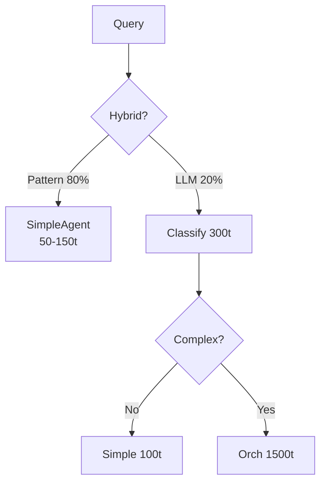

<!-- i18n: en -->

# Token Optimization ✅ 75% Savings

**TL;DR**: Hybrid classify (80% patterns=0 tokens). Batch 3-5 msgs/call. Trim history. Route simple=150t vs orch=1500t.

## Table of Contents
- [Savings Table](#savings-table)
- [Tiers](#tiers)
- [Trim Snippets](#trim-snippets)
- [Pattern Quiz](#pattern-quiz)

## Savings Table

Real-world: 100 queries/day.

From [`docs/token-optimization-guide.md`](docs/token-optimization-guide.md).

| Mechanism       | Savings | Tokens/Query |
|-----------------|---------|--------------|
| Hybrid Classify | 80%     | 60 vs 300    |
| Batching        | 55%     | 200/call     |
| Simple Routing  | 70%     | 75 avg       |
| Dedup           | 10%     | Skip retries |
| **Total**       | **75%** | 7.5k vs 30k  |

Badge: **75% ✅**

## Tiers



Integrates batch/trim.

## Trim Snippets

Trim before LLM. From [`history.ts`](packages/chat-agent/src/history.ts:10).

```typescript
// packages/chat-agent/src/history.ts
export function trimHistory(messages: Message[], maxLength: 10): Message[] {
  return messages.length > maxLength 
    ? messages.slice(-maxLength) 
    : messages;
}

// Use: const recent = trimHistory(state.messages, 10);
```

Combine batch: [`batch-types.ts`](packages/chat-agent/src/batch-types.ts:153) `join('\n---\n')`.

P50 costs: $0.0225/100q.

## Pattern Quiz

**Q**: Greeting "hi"? Tokens?

A: 0 (pattern match) ✅  
B: 300 (LLM classify)  
C: 1500 (orchestrator)

## Related
- [Benchmarks →](./benchmarks.md)

Measure tokens: Add `tokensUsed` logs. Optimize patterns!