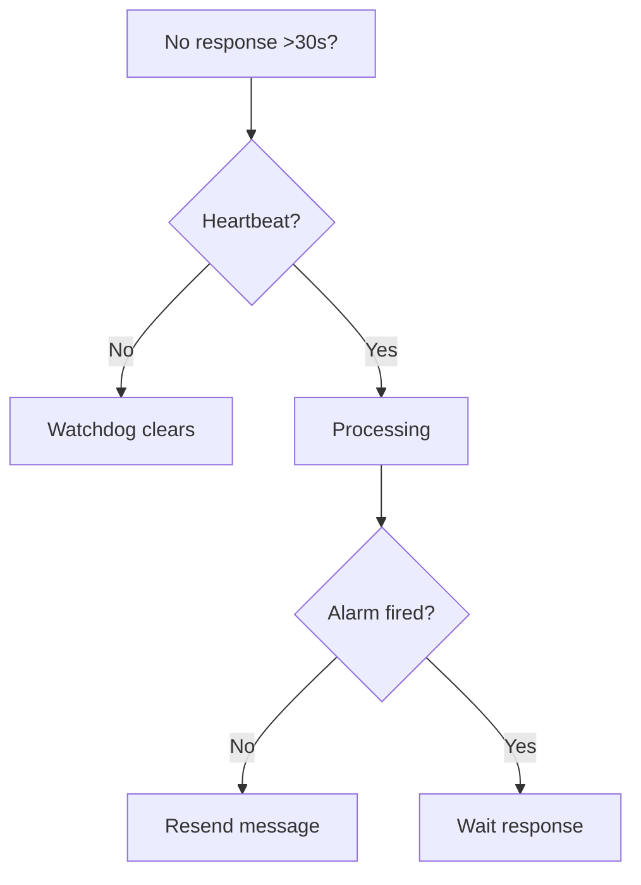
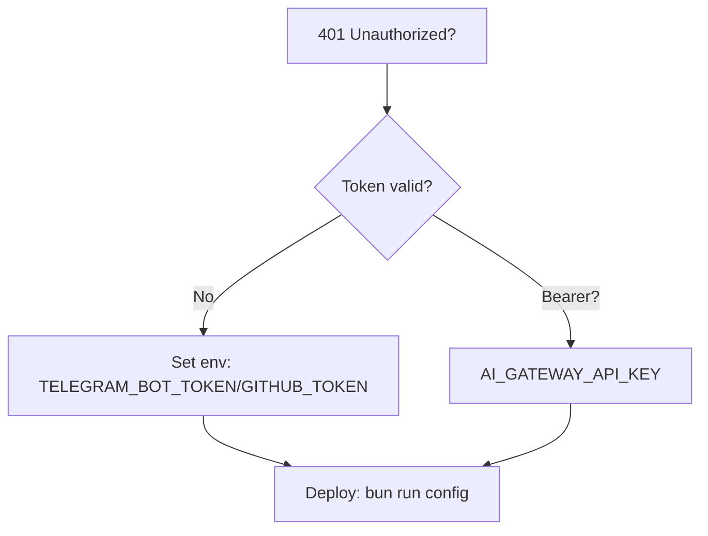

<!-- i18n: en -->

# Troubleshooting

**TL;DR**: Stuck? Check heartbeats/alarms. Auth 401? Verify tokens. Decision trees below. ✅ Recover fast.

## Table of Contents
- [Stuck Batch](#stuck-batch)
- [Auth Fail](#auth-fail)
- [Common Errors](#common-errors)

## Stuck Batch

From [`PLAN.md`](PLAN.md:322) batch/heartbeat:

## Auth Fail

From [`auth.ts`](packages/hono-middleware/src/middleware/auth.ts:19):

## Common Errors

| Error | Cause | Fix |
|-------|-------|-----|
| Batch stuck | No heartbeat | Resend query |
| 401 Auth | Missing token | `bun scripts/config.ts` |
| Tests fail | Lint error | `bun run check` |
| Deploy fail | Wrangler login | `bunx wrangler login` |

**Quiz**: Stuck >30s?  
A: Watchdog recovers ✅

**Pro Tip** ✅: Logs in Cloudflare dashboard.

**CTA**: Share fix → [Feedback](feedback.md) | [Issues](https://github.com/duyet/duyetbot-agent/issues)

**Contrib**: "Fixed X via Y!"